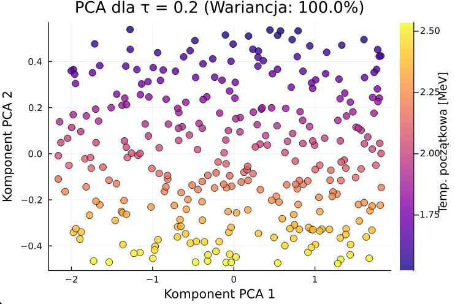
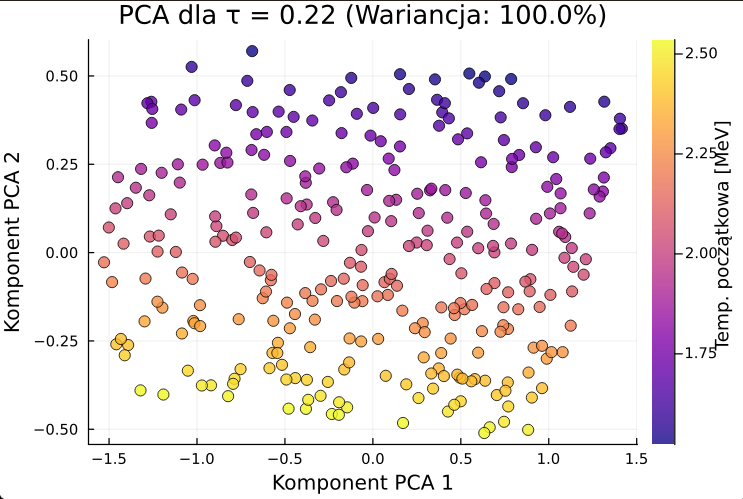
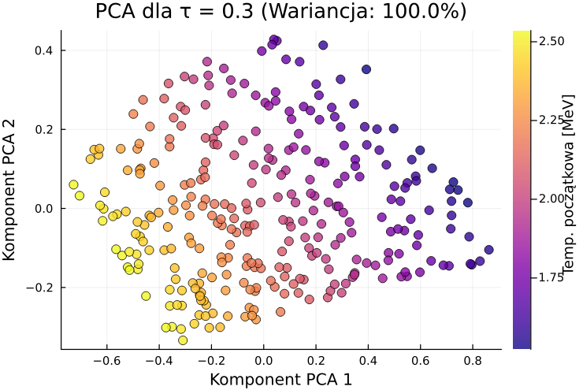
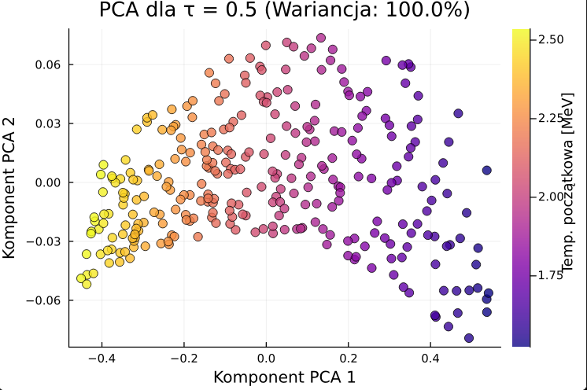
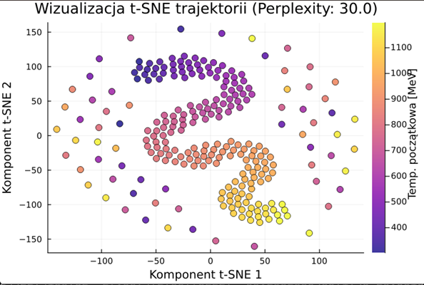
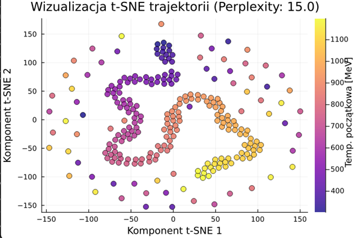
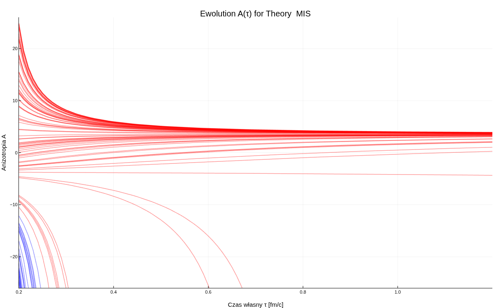

# Thesis
```bash
git clone {repo html}
cd Atractors-in-QGP
julia --project=.


```


```julia
using AtractorsQGP
dane = load_dataset("datasets/data_testSmall.jls")
plot_lle_dim(dane, 3,2,0.35)
plot_lle_dim(dane, 3,2,0.40)
plot_lle_dim(dane, 6,2,0.40)
plot_lle_dim(dane, 6,2,0.22)
plot_lle_dim(dane, 7,2,0.22)
using CairoMakie

for i in 1:20
           fig = plot_lle_dim(dane, i, 2, 0.22)
           display(fig)
            println("dla $i, daj enter")
           readline()
end

```

## Hydrodynamic Attractors in Phase Space
Wszystkie Artykuły znajdują się w [HR Articles]

### youtube
[link do zapytaj fizyka z helerem](https://www.youtube.com/watch?v=6R2ASA7-g-c&t=9s)

### Źródło różnic w rozwiązaniach równania $A(w)$
[mis_vs_brsss](notes/mis_vs_brsss.md)


## Julia
czego potrzeba do pracy z julia?
1. [Julia](https://julialang.org/downloads/)
2. Instalowania pakietów w menadżerze pakietów julia (REPL) poprzez wpisanie `]` i potem `add` oraz nazwy pakietu.
```bash

using Pkg
Pkg.instantiate()

# or
cd src
julia
julia> ]
(@v1.11) pkg> activate .
(src) pkg> instantiate
# copy this commands without anything before `>`

```
3. Ważne by uruchamiać julia w terminal
```bash
> julia
> include("nazwa_pliku.jl")
```
Procedura używania REPL (Read-Eval-Print Loop) w julia jest następująca:
```bash
include("modHydroSim.jl")
using .modHydroSim

# --- Eksperyment 1: Szybki test z domyślnymi ustawieniami ---
# Tworzysz obiekt ustawień bez podawania argumentów - użyje domyślnych.
settings1 = SimSettings()
result1 = run_simulation(PARAMS_MIS_TOY_MODEL, settings1);
create_log_ratio_animation(result1, filename="run_default.gif")


# --- Eksperyment 2: Dłuższa ewolucja dla modelu SYM ---
# Tworzysz obiekt ustawień, nadpisując tylko czas końcowy.
settings2 = SimSettings(τ_end=2.5)
result2 = run_simulation(PARAMS_SYM_THEORY, settings2);
create_log_ratio_animation(result2, filename="run_sym_long.gif")


# --- Eksperyment 3: Więcej punktów, inny zakres temperatur ---
settings3 = SimSettings(n_points=500, T_range=(400.0, 800.0))
result3 = run_simulation(PARAMS_SYM_THEORY, settings3);
create_log_ratio_animation(result3, filename="run_sym_dense_hot.gif")

```

### Programy napisane w julia
Programy napisane w julia znajdują się w katalogu [src](/src/).

- [Generowanie danych](src/generowanie_AiT.jl) - program generujący ewolucję $A(\tau)$ i $T(\tau)$ dla  warunków początkowych. do pliku .csv

`
## Wygenerowane wykresy
Wszystkie rysunki i wykresy wygenerowane przez kod bede starał się umieszczać w katalogu [images](/images/). Jeśli nie będzie tak żadnego wykresu to zalecam sprawdzenie katalogu [src](/src/) gdzie powinny być wygenerowane wykresy których jeszcze nie przeniosłem.

# Raport
> ## 19.07.2025

## 24.07.2025
```julia
julia> include("modHydroSim.jl")
Main.modHydroSim

julia> using .modHydroSim

julia> settings1 = SimSettings()
SimSettings(200, 0.2, 1.2, (0.2, 1.2), (300.0, 500.0), (0.0, 4.0))

julia> settings2 = SimSettings(T_range(1.0,2.0))
ERROR: UndefVarError: `T_range` not defined in `Main`
Suggestion: check for spelling errors or missing imports.
Stacktrace:
 [1] top-level scope
   @ REPL[4]:1

julia> settings2 = SimSettings(T_range=(1.0,2.0))
SimSettings(200, 0.2, 1.2, (0.2, 1.2), (1.0, 2.0), (0.0, 4.0))

julia> result_default = run_simulation(PARAMS_MIS_TOY_MODEL, settings1);
--- Rozpoczynanie Obliczeń Numerycznych...
--- Obliczenia Zakończone. ---

julia> create_log_ratio_animation(result_default, filename= "testowy.gif")
Generowanie animacji: testowy.gif...
```
Już po nauczeniu się obsługi REPL. [program modHydroSim.jl](/src/modHydroSim.jl) jest gotowy do użycia. Wystarczy go załadować i można korzystać z funkcji `run_simulation` oraz `create_log_ratio_animation` i innych.


**Wykresy i zdjęcie**
- 

- 

# **[HINTON_SNE](neural_networks/sne.pdf)** Implementacja Algorytmu SNE do badania dynamiki regukcji wymiarowości
Algorytm SNE (Stochastic Neighbor Embedding) jest używany do redukcji wymiarowości danych. W kontekście badania dynamiki redukcji wymiarowości, implementacja tego algorytmu może być przydatna do analizy danych z symulacji hydrodynamicznych m.in
takich których wyniki widoczne są w [Symulacja Ewolucji A i T](images/A_T/27.07.2025.gif) Gdzie dokładnie wydać jak zmienia się dynamika (tempo redukcji wymiarowości do z 2d do 1d)  w czasie.

- **Kod z implementacją tego Algorytmu jest umieszczony** -> [kod_sne](src/sne.jl)

*Jak używać w REPL?*

```bash
> julia
> ]
> pkg > activate . # aktywacja środowiska, jeśli jest w katalogu
> include("lib.jl")
> using .modHydroSim
# opcjonalnie ja osobiście używam using Revise by móc modyfikować kod bez restartowania REPL
#albo po prostu
> include("sne.jl")
```


## PCA
- 
- 
- 
- 


# T-SNE/sne
-
-


# 16.10.2025
Update of [Main library](src/lib.jl)
how to use
[DataFrame with inital_conditions_MIS_100](src/inital_conditions_MIS_100.csv)



```julia
julia> ustawienia = SimSettings(theory= :MIS, n_points=100, tspan=(0.2,1.2), T_range = (250*MeV, 1500*MeV), A_range = (-25,25), Z_range = (-20,20),seed = 5)
SimSettings(:MIS, BRSSSParams(0.20799208610746486, 0.07957747154594767, 0.0), Main.modHydroSim.ode_brsss!, (0.2, 1.2), 100, (1.2690355329949237, 7.614213197969542), (-25.0, 25.0), (-20.0, 20.0), 5)

julia> generate_and_save_ics(settings = ustawienia, output_filename_base="inital_conditions_MIS_100")
Zapisano warunki początkowe do inital_conditions_MIS_100.csv
Zapisano warunki początkowe do inital_conditions_MIS_100.h5
100×4 DataFrame
 Row │ Run_ID  T_0      A_0         Z_0
     │ Int64   Float64  Float64     Float64
─────┼─────────────────────────────────────────
   1 │      1  2.56329   -0.714145   14.4498
   2 │      2  6.92015   11.4684    -14.3117
   3 │      3  6.78966  -21.2536     -3.59641
   4 │      4  3.95529  -22.7316    -16.4062
   5 │      5  4.13734    7.14756     8.27515
   6 │      6  7.57515  -19.3333     11.7514
   7 │      7  6.27432   11.4878      4.1076
   8 │      8  1.44122    4.49841   -16.8651
   9 │      9  3.34382  -14.9679      1.52378
  10 │     10  7.48268   18.7165    -14.2166
  11 │     11  4.26558    1.01318    -7.62315
  12 │     12  6.15588    4.40737    -6.95393
  13 │     13  5.8874    -4.81363     0.373034
  14 │     14  2.27252  -18.4101     -2.6458
  15 │     15  3.97232   21.8594    -18.0148
  16 │     16  2.32057   24.2125     13.5681
  17 │     17  2.76183  -22.1298    -15.7887
  18 │     18  7.11749   10.1082     13.3952
  ⋮  │   ⋮        ⋮         ⋮           ⋮
  84 │     84  5.69588  -23.7282    -14.5631
  85 │     85  3.80291  -24.5753     -7.9503
  86 │     86  4.36903    6.2851     -1.47336
  87 │     87  4.72279  -24.7817     -9.99041
  88 │     88  5.65362   17.519       1.49891
  89 │     89  1.29054   12.1246    -15.7277
  90 │     90  4.13666   -4.60417     5.70431
  91 │     91  3.50753   23.8279    -13.277
  92 │     92  3.65191    3.22115     1.12398
  93 │     93  7.36188    1.6227    -10.4341
  94 │     94  7.58586    1.09245   -17.03
  95 │     95  6.33136  -19.9576     -3.65152
  96 │     96  6.62208   13.7746    -18.1058
  97 │     97  5.37986  -16.969      17.5317
  98 │     98  4.3407    22.3485     13.9696
  99 │     99  2.66204   -9.06576    -3.95447
 100 │    100  5.15818   -0.485772    2.62082
                                65 rows omitted

julia> symulacja = run_simulation(settings=ustawienia, ic_file="inital_conditions_MIS_100.csv")
Starting simulation for theory: MIS...
Loading of initial_conditions : inital_conditions_MIS_100.csv
############## big spam

julia> wykres(symulacja)
Opening in existing browser session.
false


```
Narazie jeszcze nie moge dodawać zdjęć przez neovim do readme wiec zostawie to na potem
Wszelkie odkładniejsze opisy tych zjawisk znalezionych tutaj od teraz będe umieszczał w odpowiednim
pliku na overleaf


# Citation
```tex
@misc{bezubik2025attractors,
  author       = {Krzysztof Bezubik and Michał Spaliński},
  title        = {Thesis; Atractors in Physics of quark gluon plasma},
  year         = {2025},
  version      = {1.0.0},
  url          = {https://github.com/kitajusSus/Atractors-in-QGP},
  note         = {If you use this work, please cite it using this entry.}
}
```
# Reference
